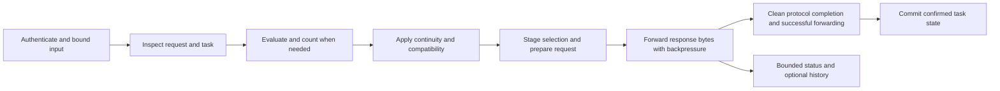

# AutoRouter Rust rewrite plan

Replace the complete AutoRouter implementation with a native Rust application while retaining its routing, protocol, CLI, configuration, privacy, and operational behavior. Develop it alongside the working JavaScript implementation, use that implementation as a compatibility oracle, and change the default distribution only after the Rust version passes functional and performance gates.

The likely gains are lower startup cost, memory use, CPU spent processing large requests, and overhead under concurrency. Rust will not accelerate an external Ollama model or Anthropic generation by itself. The rewrite must demonstrate where it helps before making end-to-end performance claims.

This is an implementation proposal, not an implemented migration or measured Rust speedup. The baseline is repository commit `ea930c2`, package version `0.5.2`, reviewed on October 9, 2026. Code and tests at that commit take precedence over older release summaries. The [previous improvement plan](improvement-plan.md) describes historical work and is not the rewrite backlog.

## Scope and completion criteria

The end state is one native `claude-autorouter` executable containing every product command, including status rendering. It does not embed JavaScript, invoke Node for routing or launching, or rely on a JavaScript sidecar. Claude Code and Ollama remain external programs with their existing responsibilities. Compiled Rust dependencies are acceptable; users should not need Cargo or a compiler to run a distributed binary.

Keep the existing package and command name, npm installation route, macOS and Linux support including WSL, configuration paths, saved credentials, session files, and command behavior. Add direct native archives as another installation option. Native Windows support is outside this rewrite's scope. Audit CPU architectures, libc requirements, minimum OS versions, and corporate TLS environments before choosing release targets; the current npm package has no CPU restriction, so four convenient binary targets alone do not establish platform parity.

Port the development and release tooling into a Rust `xtask` program as well: evaluation reports, synthetic and live validation, context probes, benchmarks, transfer bundles, package verification, and release checks. Keep Node only as a temporary reference-test dependency and as part of testing the npm installation ecosystem. Retire JavaScript product code and its tool implementations only after their replacements are verified. Keep synthetic fixtures and historical evidence readable.

Completion requires all of the following:

1. Every behavior area below has passing Rust coverage and no unexplained differential failures against the frozen baseline.
2. Provider response bodies remain byte-for-byte identical, and authentication, permission review, compatibility, continuity, privacy, and resource bounds pass adversarial tests.
3. Existing user configuration, Keychain entries, supported history schemas, and pricing provenance work without mandatory migration or reauthentication.
4. Installed native and npm artifacts pass complete launcher and cleanup tests on the supported platform matrix, including installation with lifecycle scripts disabled.
5. Predeclared performance gates pass on representative hardware, with synthetic transport, real evaluator performance, and task quality reported separately.
6. Help, contributor workflows, release verification, rollback instructions, and required CI checks cover the native implementation. A gateway-only port is not completion.

## Functionality parity inventory

Create a machine-readable parity manifest in phase 0. Each row below becomes cases identified by source test name, input fixture, expected behavior, Rust test, differential result, and any explicitly reviewed difference. Run the full existing suite as well; this inventory is not a substitute for tests that already cover finer details.

| Area | Behavior to retain | Baseline implementation and evidence |
| --- | --- | --- |
| Commands and help | Default invocation, `setup`, `config show/set/unset`, `sessions list/show`, `doctor`, `doctor --evaluate-local`, `claude`, `serve`, help, version, JSON output, exit codes, stderr behavior, hidden status renderer, and arbitrary Claude argument forwarding. Claude help/version bypass configuration and evaluator startup. | [CLI](../bin/autorouter.mjs), [help](../src/cli-help.mjs), [onboarding](../src/onboarding.mjs); `cli-help`, `onboarding`, `config-command`, `session-history`, and `local-diagnostic` tests. |
| Configuration | Flat environment-style keys; exact defaults, validation and empty/unset distinctions; explicit/XDG/home path resolution; file then environment precedence; inactive evaluator settings do not break launches. `--force` preserves unrelated settings, `--replace` is explicit, malformed/unsupported files remain intact, and project `.env` files are never loaded implicitly. | [config](../src/config.mjs), [saved config](../src/user-config.mjs), [config command](../src/config-command.mjs); corresponding tests and [reference](reference.md#configuration). |
| Organization policy | Fixed system policy paths; trusted owner, permissions, file type and symlink checks; fail closed on invalid policy; allowlists reject prohibited choices; locks override file/environment values. Repair commands can correct disallowed configuration without bypassing policy. | [policy](../src/policy.mjs), `policy.test.mjs`, config/onboarding tests. |
| Secret storage | Hidden input and stdin, no secrets as CLI values; existing Keychain service/account identity and configuration-path scoping; file/Keychain migration ordering and read-back verification; explicit Keychain failures versus documented default-setup fallback; environment overrides and locked-store behavior. `sessions` never accesses Keychain. | [Keychain](../src/keychain.mjs), [saved config](../src/user-config.mjs); `keychain`, `user-config`, `config-command`, and `onboarding` tests. |
| Launcher and lifecycle | Installed unmodified Claude executable, loopback ephemeral port, temporary gateway credential, child environment filtering/defaults, profile/model/permission argument precedence, inherited terminal I/O, signals and child exit status. Preserve temporary settings overlays, relative permission paths, saved settings, startup failure cleanup and crash-leftover cleanup. | [onboarding](../src/onboarding.mjs), [auth](../src/auth.mjs), [settings](../src/status-settings.mjs), [cleanup](../src/status-cleanup.mjs); onboarding, auth, status-settings, status-cleanup, launcher-logging and package-lifecycle tests. |
| Local gateway | Endpoint/method allowlist, health semantics, local authentication, subscription OAuth and beta requirements, API-key forwarding, query strings, header filtering, errors, request validation, transport deadlines, disconnects and compressed-response forwarding. Retain rejection of compressed request bodies. | [server](../src/server.mjs), [validation](../src/request-validation.mjs), [auth](../src/auth.mjs); `server`, `auth`, `request-validation`, and `protocol-fixtures` tests. |
| Classification and task extraction | Both `/v1/systemone` integrations, existing question rubrics, Jev confidence floor, requested-model fallback floor, task/history extraction, goal-feedback handling, redaction, cache identity, duplicate-call sharing, and independent waiter cancellation. New tasks and sequential tool continuations retain evaluation behavior. | [router](../src/router.mjs), [prompt state](../src/prompt-state.mjs), [Ollama evaluator](../src/ollama-evaluator.mjs), [redaction](../src/redaction.mjs), [bounded reader](../src/bounded-json.mjs); router, router-concurrency, prompt-state, redaction, bounded-json and evaluator tests. |
| Local evaluator operations | Ollama remains the experimental default; existing model aliases/defaults and model-specific deadlines, loopback endpoint rules, localhost normalization, native endpoint checks, warmup/keep-alive and resident-model safeguards. Plain doctor performs no inference/download; local evaluation requires no Claude/cloud credentials and calls neither Jev nor Anthropic. Failed launch warmup retains conservative fallback; downloads require explicit pull authorization. Hosted Jev stays optional. | [models](../src/ollama-models.mjs), [setup](../src/ollama-setup.mjs), [diagnostic](../src/local-diagnostic.mjs); ollama-model behavior in config/setup tests, ollama-routing, ollama-evaluator, local-diagnostic tests and fixtures. |
| Routing and model compatibility | All three tiers in compatible mode; native profile behavior; Auto Sonnet/Opus switching and Haiku floor; exact catalog IDs/capabilities; conservative unknown models/extensions; signed thinking and safeguards; explicit thinking adaptation; deferred tools, system messages, attachments, context capacity and count-token policy. | [catalog](../src/model-catalog.mjs), [model request](../src/model-request.mjs), [Auto routing](../src/auto-routing.mjs), [token counter](../src/token-counter.mjs); model-catalog, model-request, auto-routing, routing-compatibility, token-counter, router and protocol-fixtures tests. |
| Execution continuity | Session/agent/prompt isolation, explicit prompt identities and content aliases, tool ownership, goal continuations, new-task switches, active versus retired tasks, capacity exhaustion, selected versus confirmed models, provider fallbacks, out-of-order attempts and restart behavior. | [turn state](../src/turn-state.mjs), [router](../src/router.mjs), [response observer](../src/response-observer.mjs); turn-state, router-concurrency, response-observer and protocol-fixtures tests. |
| Status and telemetry | Foreground/session selection, selected versus observed model labels, guard/error priority, optional status suppression, bounded asynchronous snapshots, readiness timeout, safe shutdown, event normalizer allowlists and privacy. Renderer uses bounded stdin/snapshot reads, no network, terminal-control sanitization, `NO_COLOR`, TERM and width behavior. Observability failures cannot fail or delay inference. | [status](../src/status-state.mjs), [renderer](../src/statusline.mjs), [renderer entrypoint](../bin/statusline.mjs), [telemetry](../src/telemetry-event.mjs), [contracts](../src/contracts.mjs); status-state, statusline, telemetry-event and static-contract tests. |
| History and savings | Logging off by default; metadata excludes excerpts, prompts mode is bounded/redacted; private bounded JSONL writes and safe history reads; legacy schemas 1/2; correlation of decisions/outcomes; explicit partial/truncated coverage. Preserve dated pricing tables, cache TTL rates, modifiers, unsupported usage, recorded baseline and historical provenance. Estimates remain API-equivalent, not subscription savings. | [log](../src/session-log.mjs), [history](../src/session-history.mjs), [savings](../src/savings.mjs); session-log, session-history and savings tests. |
| Contributor and release tools | Evaluation thresholds, held-out checksums, tier coverage, opt-in live checks, benchmark conditions, portable benchmark bundles, exact immutable archive checks, isolated installs, registry verification and publication state handling. | [scripts](../scripts), [evaluation report](../src/evaluation-report.mjs), [CI](../.github/workflows/ci.yml), [release workflow](../.github/workflows/publish.yml), [release guide](releasing.md); evaluation-report, benchmark, live-rubric, release and package tests. |

The JavaScript `Router.route()` embedding contract is also documented: callers without request IDs receive selected, unconfirmed continuity. Provide equivalent Rust library operations and lifecycle documentation. A native Rust library cannot be a drop-in ESM import; if external ESM consumers exist, that API migration must be explicit rather than concealed behind a claim of CLI parity.

## Rust architecture

Start a Cargo workspace under `rust/` while the JavaScript release remains working. Move it to the repository root at cutover if that improves contributor ergonomics. Use four crates, keeping internal areas as modules until an independent crate is justified:

| Crate | Responsibility |
| --- | --- |
| `autorouter-core` | Typed configuration/decision/event contracts, model catalog, compatibility, task extraction/redaction, routing policy, continuity state machine, cache identities, usage and pricing. Pure logic with injected clocks and no network or filesystem access. |
| `autorouter-runtime` | HTTP server/client, evaluators, count-token transport, bounded readers, response observation, config/Keychain/policy adapters, status/history persistence and process lifecycle. |
| `claude-autorouter` | Existing CLI commands, help, terminal input, launch orchestration and internal status rendering. Construct the async runtime only for commands that need it. |
| `xtask` | Contributor checks, fixture/reference runners, evaluation/live tools, benchmarks, package assembly and release verification. Kept out of the product archive. |

The request lifecycle remains:



Auxiliary and unsupported safety-review contracts take the existing passthrough branches. Errors, cancellation and failed forwarding release the staged attempt; they cannot take the successful commit edge.

### Dependencies and execution model

Use Tokio for asynchronous I/O and process/signal handling, Hyper with `http-body-util` and `bytes` for the gateway and Anthropic transport, and a reviewed Rust TLS integration. Hyper exposes streaming bodies with demand-driven reads, which fits the response forwarding contract. It does not by itself prove that a downstream response completed successfully. [Hyper body documentation](https://docs.rs/hyper/latest/hyper/body/index.html).

Use one long-lived connection pool per transport configuration. Keep credentials request-scoped, including refreshed subscription tokens. Configure redirect, retry, proxy, certificate-root, HTTP version, DNS, compression and timeout behavior explicitly; library defaults are not the contract. Begin with the existing HTTP behavior, then benchmark HTTP/2 separately if compatibility evidence justifies it. Do not introduce automatic inference retries.

Reqwest is an optional convenience for bounded evaluator/metadata/count requests, not the default transparent response path. If adopted, configure decompression, redirects, proxies and retries deliberately, and include body reads in deadlines. Prefer reusing the Hyper client if that avoids a second behavior surface without excessive code. [Reqwest client controls](https://docs.rs/reqwest/latest/reqwest/struct.ClientBuilder.html).

Use Serde for owned internal contracts and `serde_json` for open provider envelopes. Borrow opaque fields with `RawValue` where useful, retain the original bounded request buffer, and parse only what routing consumes. Raw values preserve their original representation when serialized, but do not solve JavaScript semantic compatibility on their own. Use an order-preserving representation where order affects hashes. [RawValue](https://docs.rs/serde_json/latest/serde_json/value/struct.RawValue.html), [JSON object ordering](https://docs.rs/serde_json/latest/serde_json/enum.Value.html).

A CLI parser such as Clap may handle AutoRouter commands, but treat arguments after `claude` as an opaque argument vector; preserve existing AutoRouter inspection and override rules without rejecting future Claude flags. Keep non-UTF-8 filesystem paths/arguments as OS strings where possible. Use explicit command construction rather than shell interpolation. [Clap command configuration](https://docs.rs/clap/latest/clap/struct.Command.html).

Choose and pin the supported Rust toolchain, MSRV, crate versions and features during phase 0; commit `Cargo.lock`. Use reviewed dependencies for hashing, randomness and constant-time comparisons. Avoid a new generic cache framework until it can reproduce the current admission, eviction and cancellation semantics. Keep payloads/secrets out of derived `Debug`, errors and tracing fields.

### Streaming and completion

Forward original response body buffers in order. Do not deserialize and re-emit SSE, decompress and recompress provider responses, collect an entire generation, or equate transport chunk boundaries with SSE frames. HTTP framing/header normalization may differ where allowed; application response bytes must not. Continue requesting `Accept-Encoding: identity`, and bypass observation if the provider nevertheless returns compressed data.

Implement the current bounded incremental SSE/JSON observer as a side observer that cannot interrupt forwarding. Preserve malformed/oversized-frame behavior, split UTF-8 and CRLF handling, model transitions, usage validation, tool block ownership and terminal evidence. The current inference path already reserializes request JSON; request whitespace identity is not its contract. Request preparation must nevertheless preserve unknown fields, signed history and safety settings, changing only the explicitly permitted model/thinking fields.

The highest-risk transport spike is successful forwarding. Returning a response, yielding the last buffer, polling body EOF, or dropping a body is insufficient evidence. Prove how the selected Hyper connection driver reports that all response bytes were accepted by downstream transport without a write/disconnect failure. If necessary, instrument connection writes with per-response sequence ownership and completion acknowledgements, accounting for keep-alive and pipelining; validate this before settling the adapter design. Do not wait for the whole keep-alive connection to close. This is the equivalent of the existing completed forwarding pipeline, not a claim that Claude processed or displayed the bytes.

Test a disconnect after the observer sees a terminal frame but before downstream writes finish. Neither that request nor any ambiguous, refused, superseded or truncated completion may overwrite a confirmed continuation model. If the transport library cannot expose adequate completion evidence, resolve the transport design in phase 0; permanently disabling confirmation would lose functionality.

One candidate to prove is an HTTP/1 downstream driver with pipelined flush aggregation disabled, connection-owned FIFO response records and an instrumented writer. Body EOF only arms a candidate; acknowledge it after a successful flush covering its final framing. Test partial/vectored writes, pending writes, final-framing failures, an open keep-alive connection and two pipelined responses where only the second fails. Commit an acknowledged attempt before a dependent continuation can route. This requires inspecting and testing the pinned transport implementation; it is not a guarantee supplied by the body API. [Hyper HTTP/1 configuration](https://docs.rs/hyper/latest/hyper/server/conn/http1/struct.Builder.html).

### State ownership and cancellation

Keep classification cache, pending shared evaluations, active task state, count cache and telemetry storage separate. Use a short-held state lock or a single state owner for atomic transitions; never hold a lock across network, subprocess or storage awaits. Preserve ordering with explicit attempt sequence numbers. Benchmark sharding only if contention is measured, without splitting one task's atomic state.

A shared evaluation owns its own cancellation token and subscriber registry. Each waiter has independent cancellation. Cancelling one detaches it; cancelling the last aborts the evaluator, removes its pending entry and invalidates late completion/cache insertion. A cancelled request must not cancel another agent's work. Shutdown cancels all work and joins owned tasks. Tokio child tokens support one-way propagation, but subscriber accounting and race-safe completion still belong to AutoRouter. [CancellationToken](https://docs.rs/tokio-util/latest/tokio_util/sync/struct.CancellationToken.html).

Use drop guards for mandatory attempt/subscriber cleanup and explicit async shutdown for persistence and child processes. Review every `select!` branch for cancellation safety; dropping an in-progress operation can lose state unless designed for it. Blocking filesystem/Keychain operations must retain an owner until completion, even when a caller times out. [Tokio select cancellation safety](https://docs.rs/tokio/latest/tokio/macro.select.html).

Transfer staged-attempt ownership from the handler/body to the connection completion registry while transport acknowledgement is pending. A normally exhausted body may be dropped before queued bytes finish writing; that drop must not prematurely discard the attempt. Distinguish abandonment from pending successful forwarding explicitly.

For Ollama, retain `/api/show` local-model verification before sending excerpts, rejection of remote/cloud metadata, strict native-answer validation and no automatic hosted-Jev fallback. A loopback service can itself proxy a cloud model. Preserve the existing metadata checks on uncached evaluations; caching that gate needs a separately tested invalidation policy.

### JavaScript semantic compatibility

Build a small, tested compatibility layer before translating policy:

- Distinguish missing, null, false, zero and empty strings; match numeric validation and JavaScript safe-integer bounds instead of accepting all `u64` values.
- Characterize `JSON.parse`/`JSON.stringify` behavior for property order including numeric-looking keys, duplicate keys, escaped strings, number representation and negative zero. Identity inputs must produce equivalent cache sharing, turn aliases and token-count isolation. Do not replace the full-request key with a normalized excerpt key.
- Preserve separate UTF-16 length/slice budgets used by task extraction and goal labels, Unicode-code-point budgets for prompt history, and UTF-8 byte budgets for Ollama. Include emoji, combining characters, lone surrogates and control characters. Rust `.len()` and `.chars().count()` are not interchangeable substitutes.
- Port redaction rule precedence and replacements exactly, including 0.5.2 URL/CLI credentials, cookies, provider tokens, phone numbers and checksum-validated identifiers. JavaScript regex features may require explicit parsers or several Rust regex passes. Freeze synthetic privacy fixtures before optimizing.
- Preserve unknown provider data without an accidental strict-struct rejection, recursive stack overflow or parser depth limit narrower than current supported input. Keep explicit consumed-content depth validation. Characterize invalid UTF-8, surrogate escapes, large numbers and deeply nested opaque fields rather than silently tightening acceptance.
- Verify URL normalization, environment parsing, dates, pricing rounding, path resolution, session/file hashes and Keychain account strings. Treat persisted identities as compatibility-sensitive; internal ephemeral hashes may change only when their behavioral equivalence is demonstrated.

### Bounds and persistence

Port constants and their edge behavior before tuning them. Representative baseline limits are below; phase 0 also inventories limits in every adapter and subprocess path.

| Resource | Current contract |
| --- | --- |
| Incoming body and consumed content | 32 MiB body cap; content nesting greater than 32 rejected; 10 s header and 30 s request-receive timeouts. |
| Upstream generation | 10 minute forwarding deadline, plus caller cancellation; no new whole-response body cap. |
| Evaluator and count replies | 64 KiB decision/count bodies; 1 MiB local-model metadata; streamed-byte checks even with false/missing length headers. |
| Evaluator deadlines | Jev 1,500 ms default; Ollama model-dependent default, with zero disabling only its runtime timer; separate startup warmup deadline. |
| Shared classification | At most 256 pending evaluations and 1,024 subscribers; capacity fallback; no failed/abandoned-result caching. |
| Decision and token caches | 1,000 decisions with 5 minute TTL; 100 token counts with 5 minute TTL by default. |
| Turn state | 1,000 records/attempts, bounded aliases; active tasks and pending tools survive cache expiry; only retired tasks use the 30 minute idle TTL. |
| Response observation | 64 KiB observation buffer and 256 tracked blocks; observation limits do not truncate forwarded bytes. |
| Session log queue | 1 MiB pending writes, 128 tracked sessions; explicit dropped/failed-write behavior. |
| History reads | 100 files, 10,000 directory entries, 4 MiB per file, 16 MiB total, 16 KiB lines, 5,000 records and 10,000 lines per file, with partial-coverage reporting. |

Status uses one asynchronous writer and a latest dirty snapshot, not a queue per event. Preserve the one-second readiness failure behavior, atomic replacement, private `0700` directories/`0600` files, flush semantics and cleanup after the writer is finished. Optional status/history writes must not wait on the forwarding path. Retain bounded warnings/drop reporting when logging cannot keep up.

Keep the saved JSON schema and session schema unchanged for the initial native release. Preserve no-follow/ownership/file-identity checks in history and crash cleanup. Keep the Keychain service and account derivation unchanged; initially invoking `/usr/bin/security` through the existing bounded stdin protocol is a valid Rust implementation. A later native Keychain API adapter must independently prove identical storage identity, migration and failure behavior.

Configuration writes retain exclusive creation, revision checks against concurrent edits, file fsync, atomic replacement and rejection of symlinks including dangling links. Do not change existing parent-directory permissions. Keychain accounts remain the setting name, a colon, and the first 16 hex characters of the SHA-256 digest of the lexically resolved config path, under service `claude-autorouter`; replacing lexical resolution with filesystem canonicalization could strand credentials. History readers must avoid FIFO hangs as well as symlink traversal and report partial records honestly.

Settings overlays retain safe POSIX quoting and source-relative permission-path rebasing. When relative sandbox settings cannot be safely relocated, preserve the existing behavior of skipping the overlay with a notice. Test these cases with paths containing spaces, quotes and glob characters.

## Performance strategy and acceptance

The current implementation already shares identical simultaneous classifier calls and coalesces asynchronous status writes. The [router report](router-performance.md) records synthetic large-catalog p95 around 3 ms and cached p95 around 0.014 ms on one M4, including the harness's stated conditions. These historical numbers are context, not a new baseline or evidence about Rust. The [storage report](status-performance.md) already demonstrates nonblocking writes under its simulated slow-storage conditions.

Prioritize these optimizations, retaining parity after each change:

1. Avoid launching Node and building an async runtime for fast help/version/status commands. Measure CLI startup and recurring status rendering separately from service startup.
2. Parse request structure once; borrow immutable data, avoid repeated full-body clones, and reuse computed compatibility/task facts within a request. Stream serialization into a hash where it preserves the required identity instead of allocating intermediate strings.
3. Preserve response backpressure using cheaply shared buffers and bounded observation. Reuse HTTP connections and transport clients.
4. Keep existing classifier coalescing and active-state separation. Optimize cache bookkeeping and turn lookup only after profiling shows cost; any auxiliary index must preserve ambiguous ownership behavior.
5. Keep disk/Keychain work out of request execution, with bounded queues and CPU work that cannot monopolize the async scheduler. Benchmark a bounded blocking worker path for very large JSON/redaction work; do not spawn an unbounded task per request.
6. Compare release compiler options and runtime worker counts on representative hardware. Start with optimized release builds; evaluate thin LTO/codegen choices empirically. Consider PGO, an alternate allocator or SIMD JSON only after profiles demonstrate a remaining bottleneck and parity/fuzz tests pass. Ship portable CPU targets rather than workstation-specific `target-cpu=native`. [Cargo build profiles](https://doc.rust-lang.org/cargo/reference/profiles.html).

Do not obtain a speedup by removing sequential continuation evaluation, reducing excerpt budgets, broadening cache keys, weakening redaction/compatibility, dropping history, disabling durability, or increasing deadlines. Evaluator model/rubric changes require a separate quality experiment.

### Measurement design

Introduce one external benchmark driver that launches either executable against identical local mock evaluator/upstream services. The existing router and storage harnesses import JavaScript directly and cannot directly compare native executables. Preserve them as historical regression tools while adding a runtime-neutral HTTP/process/storage harness. Compare matched workloads, not a Rust microbenchmark against Node process/network latency.

Record commit/build/toolchain, fixture checksums, command line without secrets, CPU/OS/RAM, power mode, worker count, background load, evaluator conditions and all thresholds. Use separate warmup and measured runs, alternate Node/Rust order, repeat at least five runs, and report distributions and uncertainty. Choose sample counts sufficient for p99 before measuring; do not use 60 observations as strong p99 evidence. Report startup process latency, ready-to-serve time, p50/p95/p99 routing and first-byte latency, stream stalls/throughput, CPU time, allocations, idle/peak RSS, file descriptors, request/evaluator counts and cleanup completion. Compare whole process RSS on the same OS, not V8 heap against Rust allocations.

The workload set includes cold and warm commands; small and large tool catalogs; near-limit bodies; cache hits/misses; identical and distinct requests across agents; pinned/new/goal turns; concurrency 1, 8, 32 and 128; slow clients; fragmented and compressed SSE/JSON; 429/5xx/malformed/truncated replies; evaluator timeout/zero-timeout; cancellation before and during all stages; count-token calls; capacity exhaustion; slow/failed storage; status polling; session history at read limits; and repeated launch/kill cycles. Long-running mixed workloads check bounded retention and resource recovery, not just peak throughput.

Use direct mock upstream requests as the transport control. Measure incremental gateway latency with an immediate mock evaluator and separately with fixed evaluator delays. Amdahl's law applies: reducing a small local component cannot produce a large improvement in an otherwise unchanged external inference time. Real-provider trials must retain evaluator call counts, token counts, prompt-cache effects and task-quality evidence.

### Proposed gates to freeze before implementation benchmarks

These are proposed investment targets, not measured results. Ratify them with the workload/hardware matrix in phase 0 before recording candidate measurements. Do not relax them after seeing an unfavorable candidate without a separately reviewed change in the experiment.

| Gate | Acceptance |
| --- | --- |
| Functional and deterministic resource parity | Zero unexplained differential mismatches; identical required evaluator-call counts; all cancellation, capacity, privacy and bounded-retention tests pass. |
| Cold CLI startup | At least 50% lower median startup for help/version and status rendering than the same-host Node baseline. |
| Gateway memory | At least 40% lower idle RSS and 30% lower peak RSS on the fixed large-request/concurrency workload, excluding external Claude/Ollama processes. |
| Local CPU and processing | At least 30% lower CPU time per request and 50% lower p95 large-catalog gateway processing overhead with deterministic immediate mocks. |
| No important regression | No repeated p95/p99 latency or sustained throughput regression greater than 10% outside measurement uncertainty on any declared workload; near-zero durations need an absolute noise floor declared during baseline collection. |
| Deterministic evaluator and policy parity | Identical mocked evaluator inputs, rubrics and interpreted results; unchanged quality thresholds; compatible covers all three tiers, Auto covers Sonnet/Opus. No changed routing policy disguised as an optimization. |
| Real evaluator and task evidence | Matched opt-in baseline/candidate trials with no regression outside predeclared variability bounds. Retain original acceptance statuses, fixture hashes and held-out thresholds; separately report availability, transport and task completion. |

The optimization phase is incomplete when targets fail: profile, correct, and remeasure without trading away parity. If the full rewrite cannot justify its cost, keep the working implementation as the default and make that decision explicit. Do not label a partial port or an unmet gate a successful rewrite.

Numerical benchmarks and hardware/model trials remain opt-in. Ordinary CI runs deterministic mock/resource tests; it must not download models, call paid providers or enforce workstation timing thresholds. Real Ollama tests need recorded model digest, runtime version, residency and cold/warm conditions on representative 16 GiB and larger-memory systems. Live Claude canaries need explicit invocation, isolated synthetic projects and no unrelated MCP/startup customizations. Passing mocks does not certify a current live Claude version.

The [historical local-model comparison](hardware-comparison.md) records failures of its strict quality gate. The rewrite must not require fixing inherited misclassifications to demonstrate parity, or present those failures as resolved by a language change. Preserve failed/unmeasured statuses when applicable. Do not relabel fixtures or change models/rubrics to make the rewrite pass; quality improvement remains a separate experiment.

## Validation design

Freeze the current checkout's fixtures and record a clean baseline from:

```sh
npm ci --ignore-scripts --no-audit --no-fund
npm run check
npm test
npm run test:package
```

These commands are phase 0 implementation work, not prerequisites for this documentation-only proposal. Use the supported existing benchmark forms when explicitly running a local baseline:

```sh
node --expose-gc scripts/benchmark-router.mjs baseline /tmp/rust-rewrite-node-baseline.json
node --expose-gc scripts/benchmark-router.mjs candidate /tmp/rust-rewrite-node-baseline.json
```

The second command compares JavaScript revisions with matching Node/hardware settings; it is not a native Rust comparison. The router script does not accept an additional `--check`. For status comparisons, use a separate report containing its required baseline rather than overwrite checked-in historical measurements.

Build a development-only reference adapter around pure JavaScript modules and an equivalent Rust fixture runner. Serialize deterministic inputs/results, stub evaluator answers, control clocks and inject request IDs. Compare routing reasons, prepared requests, excerpts, key equivalence, state transitions, pricing and normalized records. Normalize only declared nondeterminism such as timestamps, generated IDs and durations; never normalize away a model, guard, permission verdict or error category.

Run protocol fixtures through actual executable HTTP servers with the same fake services, including [the versioned Claude corpus](../test/fixtures/claude-protocol-v1.json). Compare exact response bytes and meaningful headers/statuses, outbound request semantics, calls, cancellation and final state. Compare evaluator request bodies/excerpts exactly where their current representation affects classification. Add randomized chunk boundaries and disconnect schedules so correctness does not depend on a convenient fixture segmentation.

Port unit and integration tests by behavior, not line count. Add property tests for arbitrary opaque extensions, round trips, cache identity and bounds; fuzz request parsing, redaction, SSE framing and history readers; run deterministic state-machine interleavings for simultaneous cancellation/completion/supersession. Keep secret canaries synthetic and assert they never reach logs, status, errors or evaluator excerpts.

Reuse launcher/package scenarios through an executable-path abstraction. The current package lifecycle harness invokes Node directly and imports installed `.mjs` modules, so pointing it at a Rust binary is insufficient. Preserve scenarios for argument/environment forwarding, settings precedence, terminal/signal behavior, failure cleanup, installed files and private storage while moving white-box assertions into Rust tests. Test signal exit behavior from a real shell/PTY where needed.

Add native CI checks using `cargo fmt --check`, `cargo clippy --workspace --all-targets --locked -- -D warnings`, `cargo test --workspace --locked`, release-build smoke tests and dependency/license review. Once the feature set exists, enumerate supported feature combinations explicitly. Keep the four required Node 22/24 on Ubuntu/macOS checks throughout migration; at completion they still verify npm installation and native execution under those package-manager environments. Add native target jobs without weakening branch or release protections.

## Packaging and rollout

Preserve `npm install -g claude-autorouter`. The preferred first design is a self-contained npm archive containing supported native binaries and a small POSIX dispatcher that only selects and `exec`s a binary. It contains no routing logic or JavaScript runtime, performs no runtime download and requires no install hook. Also publish per-target native archives when release work is separately authorized.

Validate that design early against supported targets and package size. The reviewed native pack/check/smoke/verification policy bounds compressed archives at 32 MiB, expanded tar content at 64 MiB, each file at 32 MiB and native tar entries at 256; smoke tests verify offline installation with `--ignore-scripts`. Historical JavaScript and source bundles retain 32 MiB expansion. The [retained four-target experiment](../rust/distribution/expanded-cap-proposal.md) supports this cap change, but the complete qualified matrix must still fit. All readers enforce trusted explicit policies, bounded streaming inflation/encoding and remaining release-set budgets before allocation. Platform optional packages are an alternative only with a reviewed change to dependency/offline-install semantics and exact-artifact verification. A network postinstall downloader is not a parity-preserving default.

Initial native build candidates are macOS ARM64/x86_64 and Linux ARM64/x86_64; establish libc/OS minima and any further currently supported architectures before making these the release matrix. Validate symlinked npm launchers, paths containing spaces, unrelated working directories, missing binaries, permissions, and execution without Node on `PATH`. Do not hide a Node fallback in the native runtime. Replace `doctor`'s Node prerequisite with native version/target diagnostics while retaining Claude/evaluator checks.

Retain the release workflow's immutable tested archive and registry verification model. Extend checks to native executable modes, target identification, licenses, checksums, provenance and build manifest; pack once, test those bytes, publish those bytes, and verify an isolated installed copy. Current source-file comparison must become source/build-manifest plus binary-artifact verification. No release version, tag, npm publication or user configuration change is part of this planning task.

During development, select the implementation per whole launch using separate local artifact paths; never switch engines midway through a live session. Shadow only pure decisions against synthetic fixtures, with prerecorded evaluator answers: do not duplicate live Claude/evaluator requests, persist private prompts or let a shadow process write user state.

Run native prereleases as opt-in while the current release remains the default. Upgrade at a session boundary because task continuity is process-local today. Preserve the previous package version/native artifact for rollback; unchanged config, Keychain identity and history schema make it readable by both. Verify upgrade and downgrade in isolated homes, including failed startup and partial storage writes. Do not add automatic destructive migration or concurrent old/new ownership of a status directory.

Cut over only after the complete parity manifest, package tests, measured gates and explicitly invoked live canaries are reviewed. Document exact canary versions and remaining provider limits. Retain the frozen reference and fixtures for a defined stabilization period; remove obsolete JavaScript runtime/tooling after all replacements pass, while preserving meaningful npm CI checks and historical reports.

## Implementation sequence and estimates

Estimates are engineering effort for an experienced Rust engineer familiar with the repository, including tests and review. They are planning ranges, not a delivery commitment. Two engineers can parallelize CLI/storage and protocol/core after phase 0, but integration and performance validation remain shared work.

| Phase | Deliverables and dependencies | Exit gate | Effort |
| --- | --- | --- | --- |
| 0. Characterize and prove feasibility | Tracking design issue; frozen Node reference; complete behavior/limits/platform manifest; baseline checks; runtime-neutral driver specification; declared benchmark thresholds. Spike response-flush evidence, JSON/Unicode compatibility, Keychain identity and native npm archive design. | Highest-risk contracts have executable proofs; supported platforms, dependency/toolchain choices and package strategy are recorded. | 1–2 weeks |
| 1. Build core and comparison tools | Cargo workspace, internal contracts, fixture adapter and evaluation-report tooling; model catalog, compatibility/preparation, validation, redaction/task extraction, pricing and state machines. | Pure-function/state differential suite passes, including Unicode and unknown-extension cases. | 2–3 weeks |
| 2. Build native gateway | HTTP/auth, pooled upstream transport, bounded observation, completion acknowledgements, both evaluators, shared work/cancellation, token counting and routing orchestration. Depends on phase 1 contracts. | Actual HTTP protocol corpus and adversarial disconnect/cancellation tests pass; no Node invoked by gateway. | 2–3 weeks |
| 3. Complete product workflows | All CLI commands, setup/doctor, policy/config/Keychain, launcher/settings/terminal lifecycle, status/history and savings. Can overlap phase 2. | Command/JSON/config matrix and complete installed launcher lifecycle pass on macOS/Linux. | 2–3 weeks |
| 4. Optimize and harden | Rust benchmark/evaluation/live/probe/bundle tools, same-workload comparisons, profiles, targeted optimizations, fuzz/property tests, long-running resource tests and separately authorized real evaluator/Claude canaries. | Parity/performance gates pass; real-provider comparisons satisfy predeclared regression bounds and retain honest original quality acceptance statuses. | 1–2 weeks |
| 5. Finish tooling and distribution | Remaining Rust `xtask` release tools; native/npm exact archives, CI and release verification, upgrade/rollback rehearsal, documentation and opt-in prerelease. | Full product and contributor parity, including all source-tool replacements; native/npm artifact and rollout gates pass. | 1–2 weeks |
| 6. Stabilize and cut over | Review prerelease evidence, repair regressions, switch default through a separately authorized release, retire obsolete JS after its replacements pass. | Full completion checklist above signed off; rollback retained and documented. | 1–2 weeks |

Allow approximately 10–17 engineer-weeks for the complete rewrite, with calendar time affected by parallel work and provider/platform validation. Re-estimate after phase 0 and the first complete streamed request. Redaction/Unicode parity, downstream completion evidence, native distribution breadth and platform lifecycle testing are the largest uncertainty drivers.

The first implementation PR should contain the parity manifest, reference runner, native benchmark interface and feasibility tests. It should leave the shipping implementation working. Subsequent PRs follow the dependency order above and report exactly which behavior areas and gates are complete; runtime migration begins only after the high-risk contracts are concrete.
